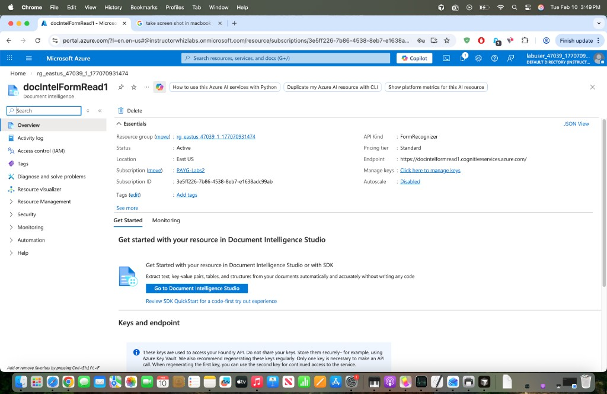

# Multi-Language AI Speech Translation

Real-time speech-to-text translation powered by **Azure AI Speech SDK**. Speaks into your microphone in English and get instant translated text (and speech) in French, Spanish, Hindi, or Kannada.

## Features

- Microphone-based speech recognition (English)
- Translation to **French**, **Spanish**, **Hindi**, and **Kannada**
- Text-to-speech synthesis of translated output using Azure Neural Voices

## Prerequisites

- Python 3.10+
- An [Azure Speech resource](https://portal.azure.com/#create/Microsoft.CognitiveServicesSpeechServices) (free tier works)
- A working microphone
- macOS: grant **Microphone** permission to your terminal app (System Settings → Privacy & Security → Microphone)

## Azure Configuration

1. Create a **Speech** resource (or a Document Intelligence / Cognitive Services resource with Speech enabled) in the [Azure Portal](https://portal.azure.com).
2. On the resource's **Overview** page you can see the resource details — location, endpoint, pricing tier, and subscription:

   

   *Azure Portal — Resource overview showing the endpoint, region (East US), pricing tier, and key management link under "Keys and endpoint".*

3. Navigate to **Keys and Endpoint**, then copy **Key 1** and the **Region** (e.g. `eastus`).
4. Create a `.env` file in the project root:

```
SPEECH_KEY=<your-speech-key>
SPEECH_REGION=<your-region>
```

## Setup

```bash
# Clone the repo
git clone https://github.com/sathyannarayan/Multi-Language-AI-Speech-Translation.git
cd Multi-Language-AI-Speech-Translation

# Create and activate a virtual environment
python3 -m venv venv
source venv/bin/activate

# Install dependencies
pip install -r requirements.txt
```

## Run

```bash
python translator.py
```

## Sample Output

```
Ready to translate from en-US

Enter a target language
 fr = French
 es = Spanish
 hi = Hindi
 kn = Kannada
 Enter anything else to stop
fr
Listening... Speak into your microphone (e.g. a short sentence in English).
Heard: "Speech hearing test. Speak in your own microphone."
Translation (fr): "Test auditif de la parole. Parle dans ton propre micro."

Enter a target language
 fr = French
 es = Spanish
 hi = Hindi
 kn = Kannada
 Enter anything else to stop
es
Listening... Speak into your microphone (e.g. a short sentence in English).
Heard: "The scientists discovered a mysterious artifact in the ancient cave."
Translation (es): "Los científicos descubrieron un misterioso artefacto en la antigua cueva."

Enter a target language
 fr = French
 es = Spanish
 hi = Hindi
 kn = Kannada
 Enter anything else to stop
hi
Listening... Speak into your microphone (e.g. a short sentence in English).
Heard: "The old scientist discovered a mysterious artifact in ancient cave."
Translation (hi): "पुराने वैज्ञानिक ने प्राचीन गुफा में एक रहस्यमय कलाकृति की खोज की।"

Enter a target language
 fr = French
 es = Spanish
 hi = Hindi
 kn = Kannada
 Enter anything else to stop
kn
Listening... Speak into your microphone (e.g. a short sentence in English).
Heard: "The old scientists discovered a mysterious artifact in the ancient cave."
Translation (kn): "ಹಳೆಯ ವಿಜ್ಞಾನಿಗಳು ಪ್ರಾಚೀನ ಗುಹೆಯಲ್ಲಿ ನಿಗೂಢ ಕಲಾಕೃತಿಯನ್ನು ಕಂಡುಹಿಡಿದರು."
```

## License

MIT
